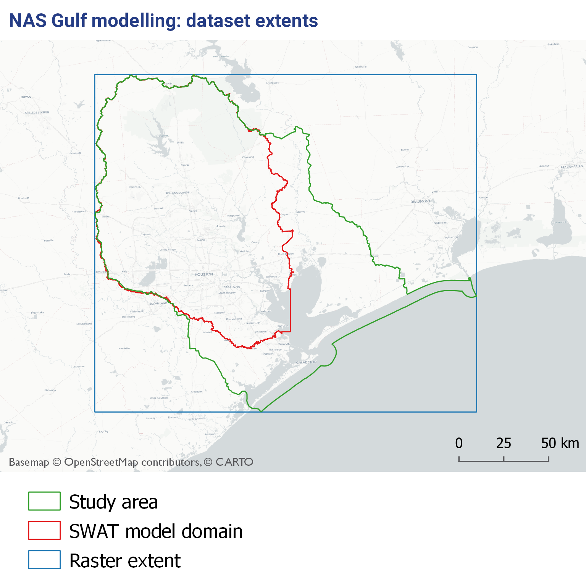

# Description

This is a short script which was used to create a 100x100m resolution raster covering the entire study area. This raster has been used as a template for all input datasets to ToxPi

The values in the raster file are simply an index of the raster cells, i.e. from 1 to 4,016,688. This index is retained when any data is transformed from raster to csv, which means it can be manipulated further (e.g. in ToxPi) and then matched back to the raster.

The template file is saved at: `output/raster_template/raster_template.tif`.

And key details in `output/raster_template/header.txt`:

> dimensions  : 1884, 2132, 1  (nrow, ncol, value)
> resolution  : 100, 100  (x, y)
> extent      : 890267.3, 4141995.6, 1103467.3, 4330395.6  (xmin, xmax, ymin, ymax)
> origin      : 890267.3, 4330395.6
> coord. ref. : NAD83(2011) / Texas South Central (EPSG:6587) 
> source      : raster_template.tif 
> min value   : 1 
> max value   : 4016688

The map below gives an overview of the study area and the extent of the raster:

