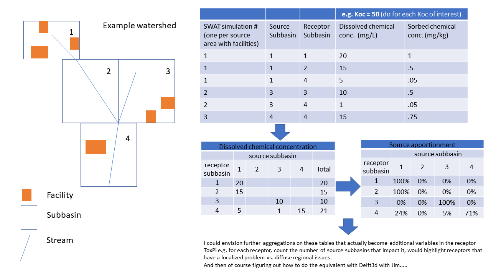

# Description

This folder contains an example sql query to extract BQ data from the SWAT source apportionment simulations, and then an R script which gives an example of how to use this to calculate the source apportionment for each subbasin.

Lauren's original concept:



The table in BigQuery `edf-aq-data.healthy_gulf.SWAT_output_rch` contains a number of simulations where the `model_info` begins: "chemtest..". Each of these is a simulation where just one subbasin is a chemical source area. The last three digits of the `model_info` records the source subbasin, e.g. "chemtest_0508_koc50_138" = subbasin 138 as the source.

Aggregating this (across the daily output) gives us the average amount of the inital source chemical that ended up in any other subbasin, and doing this for many different simulations can tell us for any subbasin, the total amount of chemical that ended up there and which subbasin it came from.

`01_rch_source_app_query.sql` is carrying out this step for the four inital simulations, which gets us to table 1 in the diagram. The script `02_calculate_source_pct.R` is then taking us to table 2 and 3, except in a tidy data format.


## R calculation example


```r
# read in csv from sql query
src.df <- read_csv("data/BQ/rch_source_app - chemtest.csv")
head(src.df)
```

```
## # A tibble: 6 x 6
##   model_info           source_sub receptor_sub avg_solpst_in avg_sorpst_in count
##   <chr>                     <dbl>        <dbl>         <dbl>         <dbl> <dbl>
## 1 chemtest_0508_koc50~        138          138      3063291.          653.  1461
## 2 chemtest_0508_koc50~        138          148       712318.       343587.  1461
## 3 chemtest_0508_koc50~        138          159       169643.       206736.  1461
## 4 chemtest_0508_koc50~        138          166       146888.        71189.  1461
## 5 chemtest_0508_koc50~        138          184       109707.        35245.  1461
## 6 chemtest_0508_koc50~        138          185        64525.        22563.  1461
```


```r
# group table by the receptor subbasin ID, and calculate the fraction of SOLPST_IN and SORPST_IN from each source subbasin.
receptor_pcts <- src.df %>% 
  group_by(receptor_sub) %>%
  mutate(solpst_pct = avg_solpst_in / sum(avg_solpst_in),
         sorpst_pct = avg_sorpst_in / sum(avg_sorpst_in)) %>% 
  arrange(receptor_sub)

# example for subbasin 184, we can see that 51.8% of the SOLPST_IN comes from subbasin 167
filter(receptor_pcts, receptor_sub == 184) %>% 
  select(source_sub, receptor_sub, avg_solpst_in, solpst_pct)
```

```
## # A tibble: 4 x 4
## # Groups:   receptor_sub [1]
##   source_sub receptor_sub avg_solpst_in solpst_pct
##        <dbl>        <dbl>         <dbl>      <dbl>
## 1        138          184       109707.     0.0904
## 2        148          184       166976.     0.138 
## 3        149          184       308005.     0.254 
## 4        167          184       628559.     0.518
```


This example shows the concept but not the full picure, as because we only have 4 simulations there are only 4 possible source subbasins in this data. So for each receptor subbasin in this table we're seeing the fraction of SOLPST_IN that comes from subbasins 138, 148, 149 and 167. But once all simluations are produced, re-running the query will give the full picture.

It's possible to map these results:


```r
# read in shapefiles

# read in subbasin sf and rivers sf
subs.sf <- st_read("data/spatial/subbasin/subs1_fixed.shp") %>%
  select(subbasin = Subbasin)

# rivers sf
rivs.sf <- st_read("data/spatial/riv1/riv1.shp") %>%
  select(subbasin = Subbasin)

# create a receptor sf table by joining to subbasin file
receptor_pcts.sf <- subs.sf %>% 
  inner_join(receptor_pcts, by = c("subbasin" = "source_sub")) %>% 
  arrange(receptor_sub)


# sf tables for receptor 184 and its source subbasin

# sources
src_subs.sf <- filter(receptor_pcts.sf, receptor_sub == 184)
# source and receptor labels
src_subs_labs.sf <- subs.sf %>% 
  filter(subbasin %in% c(src_subs.sf$subbasin, 184)) %>% 
  st_centroid()
# receptor 
rec_subs.sf <- filter(subs.sf, subbasin == 184)


# create map

ggplot() +
  geom_sf(data = src_subs.sf,
          aes(fill = solpst_pct), 
          lwd = .3) +
  geom_sf(data = rec_subs.sf, 
          fill = NA, 
          aes(col = "receptor subbasin"), 
          lwd = 0.5) +
  
  scale_fill_distiller(palette = "YlGnBu", 
                       direction = 1, 
                       breaks = seq(0, 1, 0.2), 
                       limits = c(0, 1), 
                       labels = scales::percent) +    
  
  geom_sf_text(data = src_subs_labs.sf, 
               aes(label = subbasin), 
               col = "black",
               size = 3, 
               alpha = .5) +
  
  coord_sf(datum = NA) +
  theme_edf() +
  theme(legend.position = "right", 
        axis.title = element_blank(),
        legend.text = element_text(size = 7)) +
  labs(title = paste0("Soluble chemical source % for subbasin ", 184), col = "")
```


