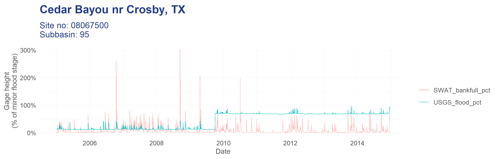
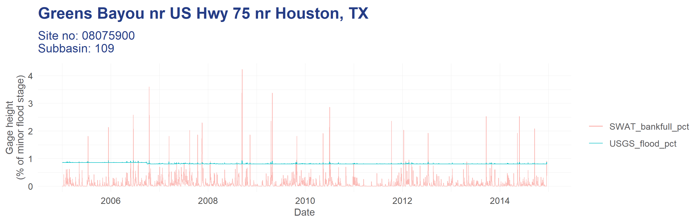
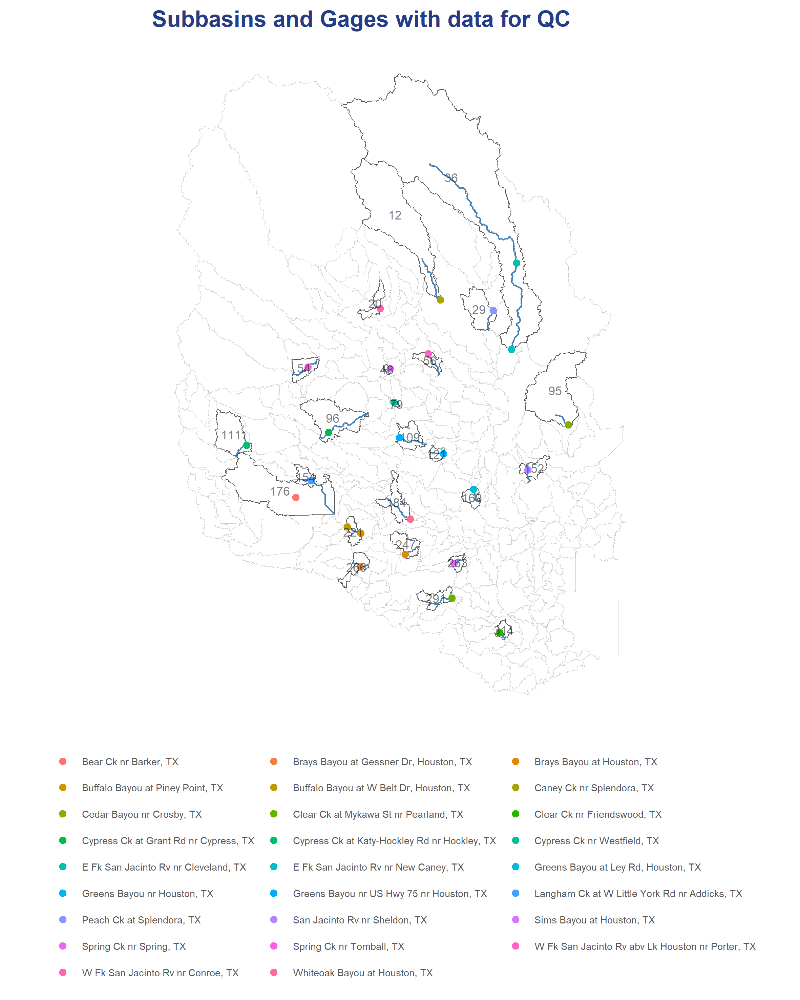
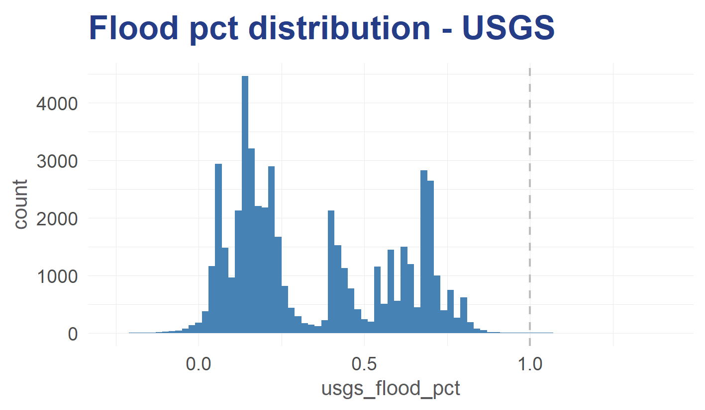
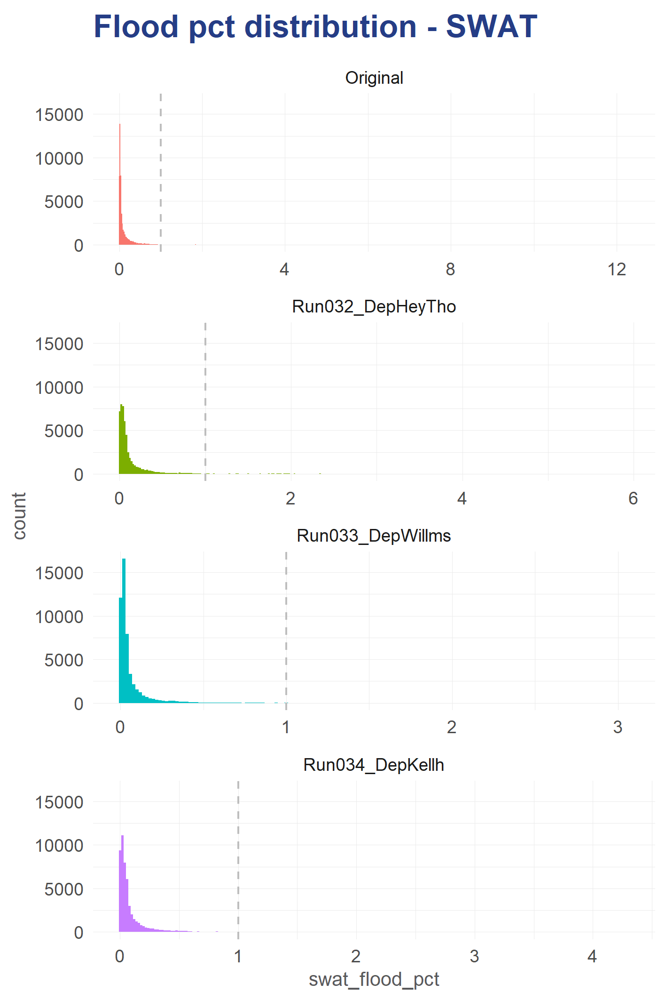
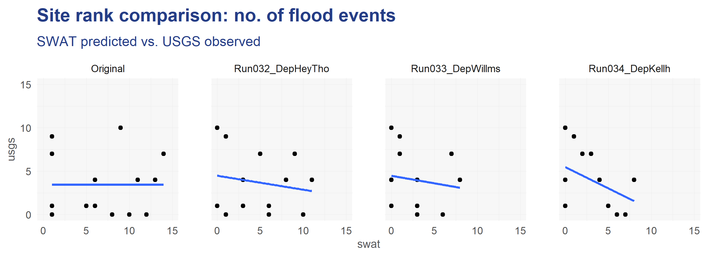
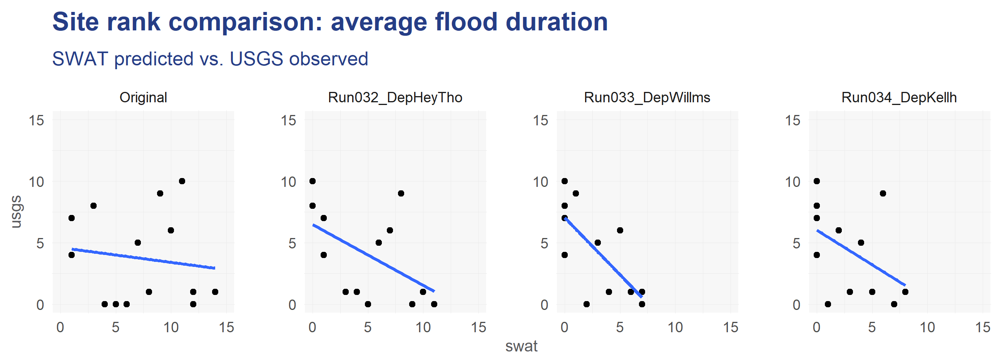
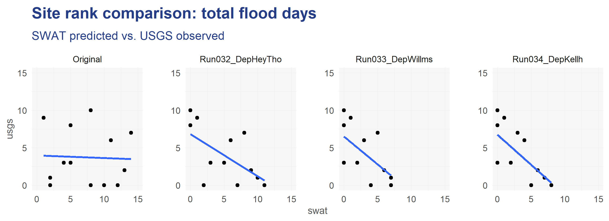

# Bankfull QC v2

## Starting point

- SWAT daily flow predictions per Subbasin (2005-01-01 to 2014-12-31)
    - and per model: Original data from Lauren, and then three iterations of Jens’s model
- USGS gage height data

**76** gages fall within study area Subbasins

**58** gages which also have USGS gage height data

**26** gages which also have the minor flood stage info

******23****** gages which have USGS gage height data on over 95% of the days in the time range.

7 gages have unusual gage height data where there is a sudden jump in the baseline level (see e.g. below).

And 2 gages (08068275, 08075900) have baseline gage height > 75% meaning they’re counted as flooding almost constantly.

For most analysis these are excluded, meaning the results are from **14 included gages**.

Baseline jump e.g.

High baseline e.g.

These 26 gages fall within 24 Subbasins:

# QC

USGS data checks

- low no. of flood events in USGS around Ike timeline could be due to inundation being focussed around coastal areas, and north of harris county? Most gages included in this QC don’t fall within the inundation area. Sense check of gages closer to it shows big spike from 2008-09-13, e.g. gage [08072050](https://nwis.waterdata.usgs.gov/nwis/uv?cb_00065=on&format=rdb&site_no=08072050&period=&begin_date=2008-09-01&end_date=2014-12-31), which also shows increases from Harvey after 2017-08-25.  Or [08074810](https://nwis.waterdata.usgs.gov/nwis/uv?cb_00065=on&format=rdb&site_no=08074810&period=&begin_date=2008-09-01&end_date=2017-12-31), which also shows Harvey increases.

### SWAT data input

For these checks I’m testing the results of four different SWAT model runs. One of Lauren’s, and three of Jens’s in which the channel depths are varied based on different regime equations. The table below describes the differences:

| model_info | Regime equation | Mannings’n |
| --- | --- | --- |
| Original | ? | 0.01 |
| Run032_DepHeyTho | Hey and Thorne | 0.025 |
| Run033_DepWillms | Williams | 0.025 |
| Run034_DepKellh | Kellh | 0.025 |

### **Total comparison of flood counts for period**

USGS model results (at flood ≥ 85% minor flood stage)

| model_info | min | max | flood_events | flood_days |
| --- | --- | --- | --- | --- |
| Original | 0.850364 | 1.398714 | 83 | 136 |

SWAT model results

| model_info | min | max | flood_events | flood_days |
| --- | --- | --- | --- | --- |
| Original | 1.325085 | 12.29645 | 427 | 827 |
| Run032_DepHeyTho | 1.0061 | 5.946226 | 271 | 959 |
| Run033_DepWillms | 1.00189 | 3.064714 | 39 | 87 |
| Run034_DepKellh | 1.00006 | 4.292312 | 159 | 522 |

### **********Distribution of flood % between SWAT and USGS data**********

The data from SWAT and USGS are compared by a flood % value, which is calculated slightly different for each data set.

USGS - the gage height as a % of the minor flood stage for that location

SWAT - the % of the bankfull cross-section taken up by the stream flow

********USGS********

Flood % from USGS shows an uneven distribution, seems to be from the fact that diferent gages have quite different baseline levels of volume, for instance at 45% mostly until spikes above that point.

*note - some usgs_flood_pct scores are < 0 because of negative gage height records. I’m not entirely sure how this occurs..

********SWAT********

These results show a very different distribution, with a hard skew to 0 and a really long tail.

| model_info | SWAT
floods | USGS
floods | n_true_positives | precision | recall | mean_flood_pct | mean_flood_pct_at_SWAT_predict |
| --- | --- | --- | --- | --- | --- | --- | --- |
| Original | 827 | 136 | 45 | 0.054414 | 0.330882 | 0.348572 | 0.469458 |
| Run032_DepHeyTho | 959 | 136 | 37 | 0.038582 | 0.272059 | 0.34914 | 0.423909 |
| Run033_DepWillms | 87 | 136 | 18 | 0.206897 | 0.132353 | 0.349091 | 0.59799 |
| Run034_DepKellh | 522 | 136 | 26 | 0.049808 | 0.191176 | 0.349116 | 0.441842 |

## Comparison of relative flood metrics between SWAT and USGS

Three metrics are used here:

- the number of flood events (which is any period of flooding sustained for 1 day or more)
- the total number of flood days
- the average duration (in days) of flood events

For both SWAT and USGS these metrics are ranked across gages and then compared:

## Regressing flood % values at each site

